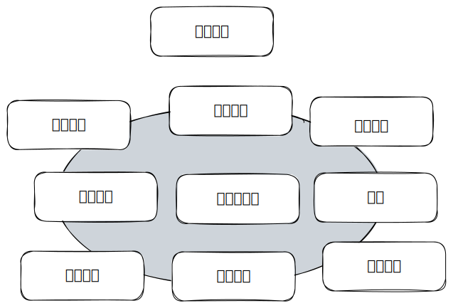

# 第一章 欢迎来到软件构建

## 1.1 什么是软件构建

开发计算机软件是一个复杂的过程，在过去的25年里，研究人员发在软件开发中涉及到诸多不同的活动，它们包括：

* 问题定义
* 需求开发
* 构建计划
* 软件架构或者高层次设计
* 详细设计
* 编码和调试
* 单元测试
* 集成测试
* 集成
* 系统测试
* 故障维护

对于从事过非正式项目的人来讲，以上的各项显得太繁复，而对于从事过过度正式项目的人来讲，以上内容却又是特别真实的。

如果你是自学编程或者从事非正式项目，你可能都分不清楚上面提到的各项活动的区别，你会将他们通通归结为**编程**。

本章题目中的“**构建**”，它的本意其实是非常清楚的，但很容易被局限住。将**构建**和其他活动放在一起，有助于理解构建和其他的活动，和它们各自的侧重点。

本书的定位是一本关于**构建**技巧的手册，所以不会对其他内容进行详细的介绍，只是相关主题上会讨论其他活动。**构建**有时候也被认为是“编码”或者“编程”，“编码”并不是一个特别好的描述，因为它暗示这个过程只是一个将已有的设计翻译为计算机语言的机械性的过程，而构建并不仅仅是机械性的，往往还伴随着创造和判断。所以在接下来的内容中，只有”编程“一词是和构建等价的。

魔鬼藏在细节里，以下是一些在构建中的任务：

* 确认前期准备工作已经完成，以确保构建能够顺利进行
* 决定你的代码该如何被测试
* 设计并编写类和过程
* 创建并命名变量和常量
* 选择控制结构并组织代码块
* 对自己的代码进行单元测试，集成测试和调试
* review团队中其他成员的底层设计和代码，并且让他们也review你的
* 认真格式化代码并且做好注释
* 集成单独开发的模块
* 优化代码，让它跑的更快，消耗资源更少

上面列举了很多构建中的任务，我们也就区分出来哪些不是构建中的任务了，例如：项目管理，需求开发，软件架构，用户界面设计等等。

## 1.2 为什么软件构建如此重要？

当你阅读这本书的时候，或许认为提升软件质量和开发者的生产力是重要的。各行各业都在使用软件，如果提升软件构建实践，那么这些行业都能受益。

为什么软件构建如此重要，大概有以下几个原因：

### 构建在软件开发中占据很大一部分

根据项目大小的不同，在一个项目中构建一般占据30%\~80%的项目时间。占据这么多项目时间的事情一定会影响到项目的成功与否。

### 构建处于整个软件开发的中间位置

需求开发和架构处于构建之前，系统测试处于构建之后。构建处于整个软件开发过程的中间位置。

### 专注于构建，程序员可以极大释放自己的生产力

### 源代码是构建的产物，一般也是唯一能够准确描述软件的事物

在很多项目中，对程序员而言唯一的文档就是代码本身。需求规格说明书和设计文档可能会过期，但源代码始终是最新的。所以有必要保持代码的高质量。

### 构建是整个项目中唯一必须要完成的

我们可以不做需求规划，架构升级，代码测试，但总是要完成软件构建的。
