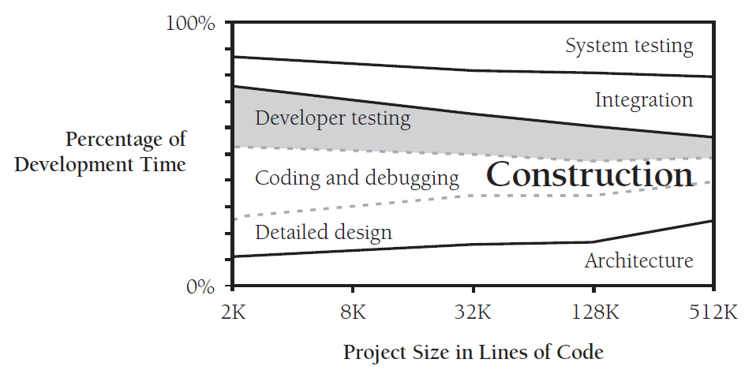

# 第二十二章 开发者测试

测试是提高软件质量最常见的方法，这一行为被业界，学术界和商界大力支持者。

软件通常被各种方式测试，有些是开发者使用的，有些是专门的测试人员使用的。

| 测试类型 | 测试对象                    | 备注                          |
| ---- | ----------------------- | --------------------------- |
| 单元测试 | 一个完整的类，例程，一小段代码         |                             |
| 组件测试 | 一个类，一个包，一段代码，多个程序员完成的代码 |                             |
| 集成测试 | 多个类，包，组件                | 一般会在有两个或以上类的时候开始，直到整个整个系统完成 |
| 回归测试 | 之前测试测试通过的代码             |                             |
| 系统测试 | 整个系统，包括集成的软件和和硬件        |                             |

除了上述提到了几种测试，还有beta测试，用户接受度测试，性能测试，平台测试，压力测试等等，并且这些一般都不会由开发人员来进行。

## 22.1 开发者测试在软件质量中扮演的角色

测试是软件质量中非常重要的一环，但很多时候也是唯一的一环，这点是非常危险的，因为我们在协同开发实践（[collaborative-construction.md](collaborative-construction.md "mention")）中发现bug的几率要高于测试的时候，并且找到错误的成本更低。单独的测试通常能发现50%的错误，组合型测试能发现60%的错误。

对于开发者来说，测试是一件困难的事情，大概有以下原因：

* 测试的目的是破坏性的，而开发者的目的是创造性，避免破坏的。
* 测试不能证明完全没有bug。
* 测试并不能提高软件质量，测试结果只是一个质量的指标，提高测试数量并不会提高软件质量。要提高质量不仅仅需要测试，更需要做好开发工作。
* 测试需要先预设自己的代码有bug，你才能发现bug，不然很容易会忽略它。并且你应该要认为是你发现bug，而不是其他人，例如测试人员，产品或者用户。

那么关键的问题来了，开发者到底应该花费多少的时间在测试阶段？

> **8%\~25%的项目时间。**

****

<figure><figcaption></figcaption></figure>

从上图可以看出，随着项目的不断增大，开发者测试的时间在逐渐减少。

第二个问题就是，开发者如何对待测试结果？

> 1. 我们可以从测试结果看出产品的可靠程度。
> 2. 指导我们软件的正确性。
> 3. 根据错误记录，发现常见的错误，并且可以对其做针对性的培训，技术review或者设计测试类。

### 在构建中测试

* 对自己的代码既要有黑盒测试，又要有白盒测试。
* 对于例程的测试，先单个测试，再测试例程的组合。
* 一个自我感觉良好的测试覆盖率，实际上覆盖率可能并不够好。

## 22.2 给开发者推荐的测试方法

* 对每一个需求进行测试，确保每一个都得到了实现。在需求阶段或者尽早准备测试用例。
* 对每一个相关的设计理念进行测试，确保每一个都得到了实现。在设计阶段或者尽早准备测试用例。
* 利用基础测试给需求测试和设计测试添加更详细的测试。添加数据流测试，添加全流程测试。
* 使用清单来记录你在当前或之前项目上犯的错误。

在产品的各个阶段设计测试用例，这样可以避免需求和设计阶段的错误，因为这几类错误造成的影响更严重。越早进行此类测试越能减少损失。

## 22.3 测试技巧

## 22.4 典型错误

## 22.5 测试支持工具

## 22.6 提升你的测试

## 22.7 保留测试记录
