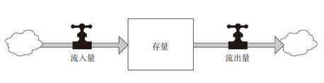

# 系统提示

系统三要件的关系

对一个系统来说，要素、内在连接和目标，所有这些都是必不可少的，它们之间相互联系，各司其职。一般来说，系统中最不明显的部分，即功能或目标，才是系统行为最关键的决定因素；内在连接也是至关重要的，因为改变了要素之间的连接，通常会改变系统的行为；尽管要素是我们最容易注意到的系统部分，但它对于定义系统的特点通常是最不重要的——除非是某个要素的改变也能导致连接或目标的改变。

如何阅读存量—流量图

在本书中，存量用方框来表示，流量则用流入或流出存量的、带箭头的水管来表示。在每个流量上标有一个T型图案，代表“水龙头”，表示流量可以被调高或调低、打开或关闭；在流量的前端或后端，有时会画一个“云朵”图案，表示该流量的资源和消耗，也就是该流量从哪里来、到哪里去。虽然我们可以进一步明确这些来源和去处，但这样会把我们对当前系统的分析变得过于庞杂。因此，出于简化当前讨论的需要，我们可以把这些因素用“云”来概略地表示。

关于行为模式图的阅读提示

系统思考者经常会使用图表来辅助理解系统的动态变化，了解系统行为随时间而变化的趋势或模式，而不只是关注个别的事件。借助行为模式图，我们可以判断系统是否正在趋向某个目标或极限点变化，也可以了解其变化的速度。

对增强回路和时间翻倍的提示

因为我们经常会遇到增强回路，所以很容易知道这一速算诀窍：对于指数级增长来说，存量翻倍所花费的时间，约等于70除以增长率（以百分数来表示）。

举例来说，如果你把100美元存入银行，年利率是7%，那么10年后，你的钱会翻一倍（70/7=10）；如果利率只有5%，那么这笔钱要翻倍就需要花14年时间。

