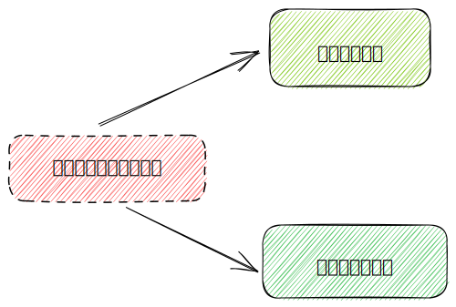

# 第五章 系统之危与机

系统性问题的表现形式很多，有些是独特的，但有些却非常常见。我们把产生常见问题行为模式的系统结构称为“基模”（archetypes），诸如公地悲剧、目标侵蚀和竞争升级等。

仅仅理解问题产生的基模结构是不够的，试着去容忍它们也不足够，我们需要去改变它们。对于它们造成的破坏，人们常常指责其中的某些参与者，或归咎于某些事件，但实际上，这不过是系统结构使然。用指责、惩罚、建立或调整某些政策这样的“标准”应对方式，很难修正结构性问题，就像试图让编排好的剧情有一个好的结果，或者对破镜子修修补补一样，都难以奏效。这就是我把这些基模称为“陷阱”的原因。

## 一、政策阻力：治标不治本

> 邓白氏公司首席经济师约瑟夫·邓肯曾说过：“从历史上看，我相信投资税贷款是刺激经济的一个有效措施。”
>
> 但是，反对者也大有人在。他们认为，无人可以证明经济发展得益于投资贷款。在过去30年中，这一政策一再被批准、调整和废除。

调节回路结构的主要表现就是会消除外部力量对系统的影响，使系统特定的行为模式保持相对稳定，没有太多变化。

但是，其他一些长期持续的行为模式，可能并不符合人们的预期，往往被视为一个问题。尽管人们发明了各种技术、采取了多项政策措施，试图去“修复”它们，但系统好像很顽固，每年都产生相同的行为。这是一种常见的系统陷阱，人们习惯称之为“治标不治本”或“政策阻力”。

**“政策阻力”来自于系统中各个参与者的有限理性**，每一个参与者都会采取某些措施，试图扭转当前的局势，使其符合自己的预期或目标。一般来说，目标与实际状况之间的差异越大，行动的压力或强度就越大。

当各个子系统的目标不同或不一致时，就会产生变革的阻力。例如城市里的毒品供应，不同的参与者对同一个存量有不同的期望，希望将其拉向不同方向。如果某一个参与者占据了优势地位，使得系统存量朝一个方向运动，那么，其他一些参与者将会付出加倍的努力，把系统存量往相反方向拉。

> 结果是，一方的努力成果会被抵消掉。事实上，某一方的成果越大，反方向的抵消力量往往也会越大，导致存量与以前的状况没有太大的差别，而这同时也是每一个人所不希望看到的。

| 参与者/子系统 | 参与者/子系统的目标                  | 参与者的行动导致的结果                                                         |
| ------- | --------------------------- | ------------------------------------------------------------------- |
| 吸毒者     | 毒品供应充足                      | :digit\_two: 不得不实施更多犯罪（如抢劫），以筹集到更多的钱去购买毒品                           |
| 执法部门    | 减少乃至杜绝毒品                    | :digit\_one: 设法切断了毒品走私的渠道，导致毒品供应量减少                                 |
| 贩毒组织    | 毒品的供应量既不太多也不太少，以保持价格和收入相对稳定 | :digit\_three: 价格暴涨给贩毒者带去了更多的利润，使得他们可以更大力度地加强毒品的走私（如购买飞机或轮船，逃避边境检查） |
| 普通居民    | 社会治安稳定，减少吸毒者抢劫的风险           |                                                                     |

### 应对“政策阻力”的两种方式和最有效的方式

| 应对方式                                                                     | 结果                                                                               | 示例                                                                                  |
| ------------------------------------------------------------------------ | -------------------------------------------------------------------------------- | ----------------------------------------------------------------------------------- |
| :red\_circle: 努力压制它。如果你拥有足 够大的权力，你可以行使权力去压制它                             | 但相应的代价可能是招致怨恨（因为可能不符合人们的期望），而一旦权力有所放松，则可能带来爆炸式的反弹。                               | 人口政策制定者、独裁者齐奥塞斯库尽力维持自己的权力，以压制对其政策的反抗。当他的政府倒台后，他和家人都被处以死刑。新政府颁布的第一部法律，就是废除对流产和避孕的禁令。 |
| 放弃、废止无效的政策，将资源和能量应用于增强和坚持更具建设性的目标                                        | 在系统中，你可能得不到这种指示，但是如果你走错了方向，你也不会走很远，因为你要花费很大的精力去采取纠正措施。这时候，如果你安静下来，那些抵抗你的人也会安静下来。 | 这种情况发生在1933年，美国终止了禁酒令，由此导致的混乱也基本上停止了。                                               |
| :white\_check\_mark: 设法将各个子系统的目标协调一致，通常是设立一个更大的总体目标，让所有参与者**突破各自的有限理性**。 | 每个人都能为了同一个目标而和谐地相处，                                                              | 战时的经济动员，或者战后或灾后的重建。                                                                 |

有时候，并不能在系统中找到一个和谐的总体目标，但这是值得人们努力尝试的一个方向。**只有放弃一些狭隘的目标，考虑整个系统更为长期的福利，才有可能找到这一目标。**

## 二、公地悲剧

> 经过数月的争吵，科尔总理领导的基督教民主联盟上周与反对派社会民主党达成了协议，收紧对避难申请的审批，以阻止大量经济移民的涌入。
>
> 对于人们共同分享的、有限的资源，很容易出现开发（或消耗）逐步升级或增长的态势。这时，就容易陷入“公地悲剧”陷阱。

**“公地悲剧”之所以产生，一个重要原因是资源的消耗与资源的使用者数量增长之间的反馈缺失了，或者时间延迟太长。**

### 防止“公地悲剧”的三种方式：

1. 教育、劝诫。帮助人们看到无节制地使用公共资源的后果，号召并激发人们的美德品行。劝说人们有所节制，以社会舆论谴责或严厉惩罚来威慑违规者。
2. **将公共资源私有化。**将公共资源分割给个人，每个人都要对自己行为的结果负责。如果某些人缺乏自控力，对资源的使用超出了其所拥有的资源的承载能力，他们也只能自食其果，伤害不到其他人。
3. 对公共资源进行管制。哈丁将这种选择称为“达成共识，强制执行”。管制可以采取很多种形式，从对某些行为的严格禁止，到配额制、许可制、税收调控以及鼓励措施等。要想奏效，管制必须有强制性的监管和惩罚措施。

## 三、目标侵蚀

> 一些系统不只是对试图改变它的政策措施具有阻力，竭力维持在一个大家谁都不愿意看到的不良状态，**更为糟糕的是，它们还在持续恶化**。这是一种被称为“目标侵蚀”的基模。

这类例子包括企业的市场份额逐渐下滑，医院的服务品质不断下降，河水或空气质量持续恶化，虽然定期节食但体重依然在增长，美国公立学校的状况日渐衰落，包括我自己一度坚持的慢跑也越来越懈怠了。

通常，反馈回路中的主体（如上述例子中提到的英国政府、企业、医院、体重超标的人、校长以及慢跑者等）会有一个绩效目标，或期望的系统状态。如果系统的实际状态与目标或期望相比存在差距，主体就会采取行动。因此，这是一个常见的调节回路，应该会使绩效表现达到并保持在期望的水平上。

但是，在这些系统中，**主体感知到的系统状态与系统的实际状态并不相同**。一般而言，主体对坏消息更加敏感，倾向于更加关注并相信坏消息，而非好消息。当实际绩效有变化时，最好的结果会被当做偏差忽略掉，而最坏的结果却被记住了。这样，**主体感知到的状况会比实际状况更为糟糕一些**。

在这个系统基模中，还有一个重要特点：**期望的系统状态会受到感知到的状态的影响**。也就是说，标准也不是绝对的。当感知到的绩效水平下滑了，目标也可以相应地下调。因此，你可能经常在生活中听到类似这样的话：“好吧，看来我们只能如此了”、“唉，我们至少不能比去年做得更差吧”、“唉，看看周围，每个人都麻烦不断”。

按照调节回路的作用，应该使系统状态维持在一个可接受的水平上，但是它却被一个具有向下趋势的增强回路所掩盖。**也就是说，感知到的系统状态越差，期望就越低；期望越低，与现状的差距就越小，从而采取更少的修正行为；而修正行为越少，系统的状态也就越差。**如果任由这一回路运转下去，将导致系统的绩效不断降低。

### 应对目标侵蚀的两个策略

1. 不管绩效如何，都要保持一个绝对的标准；
2. 不断地将目标与过去的最佳标准相对照，而不是和最差的表现相比。

## 四、竞争升级

> 星期天，伊斯兰激进分子绑架了一名以色列士兵，并威胁杀死这名士兵，除非以色列军队迅速释放被囚禁的加沙地区主要穆斯林派别创始人。**这次绑架，引发了一波激烈的暴力冲突**……三名巴勒斯坦人受枪伤，一名以色列士兵在巡逻途中被一辆过往的车辆袭击致死。除此之外，加沙地区摩擦不断，示威者向以色列军警抛掷石块，而以色列士兵则向示威者开枪，发射橡皮子弹，至少导致20人受伤。

“以眼还眼，以牙还牙”是导致竞争升级局面出现的决策规则。竞争升级源自于一个增强回路，相互竞争的参与者都试图超越对方，占据上风。系统中参与各方的目标都不是绝对的（把室内的温度设定为18℃）而是相对的，取决于系统中其他参与者的状况。也就是说，不管室内温度是多少，我都要比另外一个房间的温度高一度。

**就像其他系统陷阱一样，竞争升级也不一定就是一件坏事。如果大家竞相争夺的是一些符合人们预期的目标，例如研发出速度更快的计算机、治疗艾滋病的方法等，它就能加速整个系统的进步**。但是，如果它驱动的是恶性对抗、暴力、争吵、噪音或愤怒，它就真的是一个很危险的陷阱了。竞争升级最常见而可怕的例子是军备竞赛、地区或种族之间不可调和的矛盾与冲突，经常酿成暴力事件。

尽管有时候是破坏性的，竞争升级也可能是平静、礼貌的，涉及效率、精妙、质量等。但是，**即使竞争升级是朝着好的方向发展，也可能有问题，因为它不容易停下来。**

由于竞争升级的系统结构是一个增强回路，它是以指数级方式发展起来的，一旦超过某个限度，其使竞争激化的速度会超出绝大多数人的想象。如果不加制止或打破这一回路，这一过程通常的结果是竞争的一方被打到，甚至是两败俱伤。

### 应对竞争升级的两种方式

1. 也就是一方主动地让步，降低其系统状态，从而引导竞争对手的状态也随之下降。但实际上，它确实奏效，只要一方真有这样的决心，**并且他没有被竞争对手因其单方面的让步而击倒在地。**
2. 谈判达成裁军协定。这是一种结构性的改变，是关系到系统设计的活动。它将引进一组新的平衡控制回路，使竞争能够被控制在一定程度内。

例如，父母介入调解来制止孩子们的争吵；针对广告的大小、呈现方式等出台一些规定；在武装冲突地区部署维和部队等。对于竞争升级的系统，停战协议通常不容易达成，对于参与各方来说，也从来不会是皆大欢喜，但是相对于深陷其中而言，停战是更好的选择。

## 五、富者愈富：竞争排斥

> 最富有的那些人，在所有纳税者中只占1%的比例，在避税方面具有相当大的灵活性……他们可能现在已经拿到了奖金，而不计入下一年的收入（那时税率水平会提高），将股票期权变现……**并且想方设法将各种收入提前。**

从结构上看，这是一个增强回路，系统中的参与者会迅速被分化为两类：赢家和输家。前者的发展越来越好；后者则越来越差。

**在任何存在同质化竞争的市场中，都存在或曾经存在这样的现象**，即从系统上看，市场竞争的本质是消除市场竞争。

### 规避富者愈富陷阱的三种方式

1. 多元化。一些物种和公司有时会采用这一策略，以规避互斥性竞争。一段时间之后，新的小生境或市场又会吸引来竞争者，再次使系统迈向互斥性竞争的态势。因此，多样化也不能保证可以规避富者愈富的陷阱，尤其是当占据垄断地位的公司（或物种）有力量摧毁所有的衍生物，或者把他们买下来，或者剥夺他们赖以维持生存的资源。所以，多样化不能作为穷人的一个策略。
2. 通过植入一个反馈回路，避免任何一个竞争者完全控制，使富者愈富的反馈回路处于可控的状态。这就是“反垄断法”理论上应起的作用，当然在实践中有些也能部分地起到类似作用。
3. 通过设定游戏规则或机制，定期“校正”竞技场，防止一家独大。在传统社会和游戏中，设计者们本能地在系统中设置了一些平衡或牵制各自优势的方式，使得游戏可以保持公平和有趣。

## 六、转嫁负担：上瘾

在一些大型系统中也存在上瘾症状，并有各种不同的表现形式。例如，一些企业或行业对政府补贴的依赖，农民种地对肥料的依赖，西方国家经济体系对廉价石油的依赖，或者军火制造商对政府合同的依赖等。

这一陷阱有很多名称，包括上瘾、依赖性、将负担转嫁给干预者等。该系统的结构包括一个存量以及相关的流入量和流出量。

该参与者有一个预设的目标，通过将其感知到的该存量的实际状态与预设目标相对照，决定要采取的行动。这本质上是一个调节回路，要么改变流入量，要么调节流出量。

类似地，假如你经营着一家业绩不佳的公司，要想改变公司的经营状况，费时费力而且实属不易；但是，你有办法获得政府的补贴，这样你就可以使公司运营下去，并维持自己体面的社会地位。

为什么每个人都会跌入陷阱？首先，干预者可能无法预见最初看起来迫切需要的少量介入措施将启动一连串连锁反应，使自己越陷越深。随着系统对干预者的依赖日益增加，最终会耗尽干预者的能力。美国医疗保健系统正是在经历了这样一系列事件之后，苦苦挣扎，急需改革。

### 应对上瘾的方式

应对这一陷阱最好的办法是提前预防，防止跌入陷阱。一定要意识到只是缓解症状或掩饰信号的政策或做法，都不能真正地解决问题。因此，要将关注点从短期的救济转移到长期的结构性重建上来。

如果你是干预者，要想办法恢复或增强系统自身解决问题的能力，然后自己择机抽身退出。在需要干预时，以这样的方式实施干预，是最睿智的。

## 七、规避规则

只要哪里存在规则，哪里就存在“规避规则”（rule beating）的可能。规避规则意味着，采取一些迂回或变通措施，虽然在名义上遵守或不违反规则的条文要求，但在本质上规避了系统规则的原本意图。如果规避规则的行为导致系统产生严重的扭曲或不自然的行为，就是一个需要警惕的问题：一旦失去控制，系统将会具有强大的破坏性。

### 应对规避规则的两种方式

1. 通过强化规则及其实施力度，试图扑灭、镇压规避规则的行动。但是，这通常会激起系统更大的变形。以这种方式应对，将使人们在陷阱中越陷越深。
2. 通过强化规则及其实施力度，试图扑灭、镇压规避规则的行动。但是，这通常会激起系统更大的变形。以这种方式应对，将使人们在陷阱中越陷越深。

## 八、目标错位

影响系统行为最有力的方式之一就是，调整它的目的或目标。这是因为，目标设定了系统的方向，定义了需要采取校正措施的差距，并指示着调节回路运作的预期状态以及成败。

如果期望的系统状态是国家安全，并将其定义为军费开支数额，那么系统的行为就是军备竞赛。这可能带来国家安全，也可能不能。事实上，如果军备开支过高，超出了合理、必要的限度，或者挤占了经济建设投资，国家安全形势甚至可能被削弱。\
与规避规则恰恰相反，追求错误的目标、陶醉于错误的指标是系统扭曲的另一个特征。

而对于追求错误的目标，系统忠实地遵守着规则，并产出了特定的结果，但实际上这并非是每个人都真正需要的。

### 应对目标错误的方式

恰当地设定目标及指标，以反映系统真正的福利。一定要特别小心，**不要将努力与结果混淆，否则系统将只产出特定的努力，而不是你期望的结果。**

